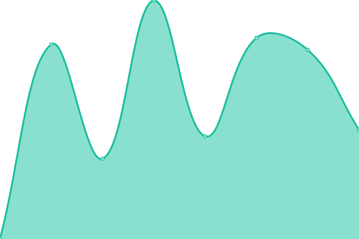
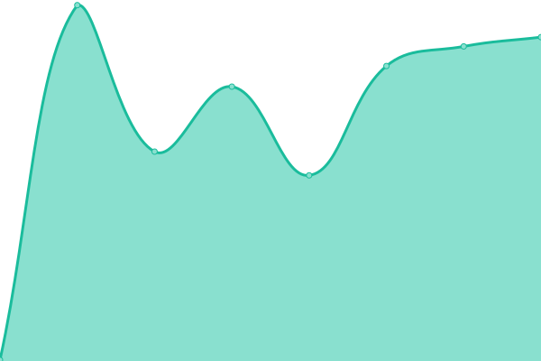
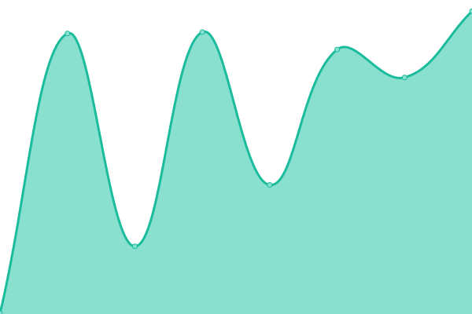

# [📈 Live Status](https://masslight.github.io/upptime): <!--live status--> **🟧 Partial outage**

This repository contains the open-source uptime monitor and status page for [MassLight](https://masslight.github.io/upptime), powered by [Upptime](https://github.com/upptime/upptime).

With [Upptime](https://upptime.js.org), you can get your own unlimited and free uptime monitor and status page, powered entirely by a GitHub repository. We use [Issues](https://github.com/masslight/upptime/issues) as incident reports, [Actions](https://github.com/masslight/upptime/actions) as uptime monitors, and [Pages](https://masslight.github.io/upptime) for the status page.

<!--start: status pages-->
<!-- This summary is generated by Upptime (https://github.com/upptime/upptime) -->
<!-- Do not edit this manually, your changes will be overwritten -->
<!-- prettier-ignore -->
| URL | Status | History | Response Time | Uptime |
| --- | ------ | ------- | ------------- | ------ |
|  [Homepage](https://www.zapehr.com) | 🟩 Up | [homepage.yml](https://github.com/masslight/upptime/commits/HEAD/history/homepage.yml) | 

 126ms
     
 | 

<a href="https://masslight.github.io/upptime/history/homepage">100.00%</a>
    

|  [Documentation](https://docs.zapehr.com) | 🟩 Up | [documentation.yml](https://github.com/masslight/upptime/commits/HEAD/history/documentation.yml) | 

 332ms
     
 | 

<a href="https://masslight.github.io/upptime/history/documentation">100.00%</a>
    

|  [Console](https://console.zapehr.com) | 🟩 Up | [console.yml](https://github.com/masslight/upptime/commits/HEAD/history/console.yml) | 

 587ms
     
 | 

<a href="https://masslight.github.io/upptime/history/console">100.00%</a>
    

|  [FHIR API](https://fhir-api.zapehr.com/version) | 🟩 Up | [fhir-api.yml](https://github.com/masslight/upptime/commits/HEAD/history/fhir-api.yml) | 

 182ms
     
 | 

<a href="https://masslight.github.io/upptime/history/fhir-api">100.00%</a>
    

|  [Platform API](https://platform-api.zapehr.com/v1/version) | 🟩 Up | [platform-api.yml](https://github.com/masslight/upptime/commits/HEAD/history/platform-api.yml) | 

 173ms
     
 | 

<a href="https://masslight.github.io/upptime/history/platform-api">100.00%</a>
    

|  [Project API](https://project-api.zapehr.com/v1/version) | 🟩 Up | [project-api.yml](https://github.com/masslight/upptime/commits/HEAD/history/project-api.yml) | 

 346ms
     
 | 

<a href="https://masslight.github.io/upptime/history/project-api">100.00%</a>
    

|  [Google](https://www.google.com) | 🟩 Up | [google.yml](https://github.com/masslight/upptime/commits/HEAD/history/google.yml) | 

 107ms
     
 | 

<a href="https://masslight.github.io/upptime/history/google">100.00%</a>
    

|  [Wikipedia](https://en.wikipedia.org) | 🟩 Up | [wikipedia.yml](https://github.com/masslight/upptime/commits/HEAD/history/wikipedia.yml) | 

 205ms
     
 | 

<a href="https://masslight.github.io/upptime/history/wikipedia">100.00%</a>
    

|  [Hacker News](https://news.ycombinator.com) | 🟩 Up | [hacker-news.yml](https://github.com/masslight/upptime/commits/HEAD/history/hacker-news.yml) | 

 295ms
     
 | 

<a href="https://masslight.github.io/upptime/history/hacker-news">100.00%</a>
    

|  [Test Broken Site](https://thissitedoesnotexist.koj.co) | 🟥 Down | [test-broken-site.yml](https://github.com/masslight/upptime/commits/HEAD/history/test-broken-site.yml) | 

 0ms
     
 | 

<a href="https://masslight.github.io/upptime/history/test-broken-site">100.00%</a>
    

|  [IPv6 test](forwardemail.net) | 🟥 Down | [i-pv6-test.yml](https://github.com/masslight/upptime/commits/HEAD/history/i-pv6-test.yml) | 

 0ms
     
 | 

<a href="https://masslight.github.io/upptime/history/i-pv6-test">100.00%</a>
    

<!--end: status pages-->

[**Visit our status website →**](https://masslight.github.io/upptime)

## 📄 License

- Powered by: [Upptime](https://github.com/upptime/upptime)
- Code: [MIT](./LICENSE) © [Anand Chowdhary](https://anandchowdhary.com), supported by [Pabio](https://pabio.com)
- Data in the `./history` directory: [Open Database License](https://opendatacommons.org/licenses/odbl/1-0/)
